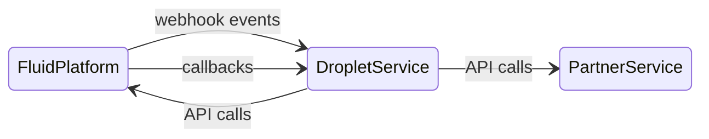

## What is a Droplet Service?

A Droplet Service coordinates Fluid's services with another, external partner service.

```mermaid
stateDiagram-v2
    direction LR

    FluidPlatform --> DropletService : webhook events
    FluidPlatform --> DropletService : callbacks
    DropletService --> FluidPlatform : API calls
    DropletService --> PartnerService : API calls
```