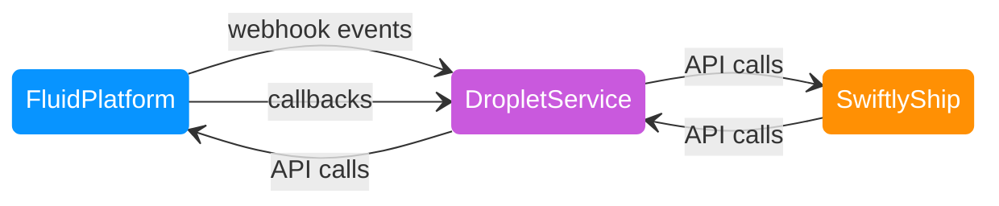

## What is a Droplet Service?

This documentation is intended to help you integrate your service with the Fluid Platform.

Let's use a hypothetical company, SwiftlyShip, as an example of how that would work.

1. SwiftlyShip needs to create a "SwiftlyShip" company in Fluid's platform to represent their company
1. SwiftlyShip needs to create a "SwiftlyShip" droplet (Fluid integration) to represent their service in the Droplet Marketplace
1. SwiftlyShip needs to handle the activities of companies using their service with Fluid's platform

A **Droplet Service** for the purposes of this documentation would be a service that coordinates Fluid's services with SwiflyShip's services.

Here's how an order could flow through the system:

1. FluidPlatform notifies the DropletService that an order is ready to ship through an `order_completed` webhook
2. The DropletService forwards the order to SwiftlyShip for fulfillment through an API call
3. SwiftlyShip processes the order and notifies the DropletService when it ships through an API call
4. The DropletService updates the FluidPlatform with the shipping status through an API call and prepares data for the shipping dashboard it will display within Fluid

Here's how shipping costs are calculated when items are added to a cart:

1. FluidPlatform makes a callback request to the DropletService when an item is added to a cart
2. The DropletService calculates the shipping cost and responds to the FluidPlatform with the amount
3. The FluidPlatform updates the cart with the new shipping cost

Note: While we show the Droplet Service and SwiftlyShip as separate services in these examples, they could be implemented as a single service. We separate them in our documentation to show their different responsibilities: the Droplet Service coordinates communication with Fluid's platform, while SwiftlyShip manages the core shipping functionality.
